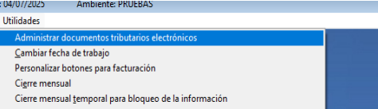
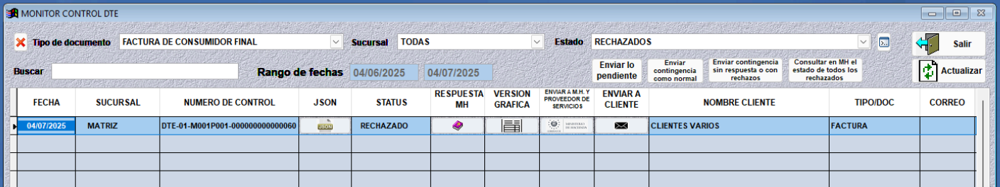

Corrección de DTE
=================

Esta guía explica cómo corregir documentos tributarios electrónicos (DTE) que han sido rechazados por Hacienda por diversos motivos.

Para acceder a los documentos rechazados:

1. Diríjase al menú **Utilidades > Administrar documentos tributarios electrónicos**.

2. Seleccione el tipo de documento (Factura de consumidor final, comprobante de crédito fiscal, nota de crédito, etc.) que ha sido rechazado.

3. El estado del documento debe estar en **Rechazado**.

Hacienda puede rechazar documentos por diversas razones, entre ellas: errores en el correo electrónico, NRC, NIT o en el número de actividad económica. A continuación, se presentan los diferentes tipos de rechazos y sus soluciones:

.. toctree::
   :maxdepth: 2
   :caption: Tipos de Rechazo:

   correccion-dte/codigo-generacion-existente
   correccion-dte/correo-electronico
   correccion-dte/nrc-no-correspondiente
   correccion-dte/nit-no-existente
   correccion-dte/codigo-actividad
   correccion-dte/valor-tipo-operacion-no-permitido
   correccion-dte/reenvio-documentos