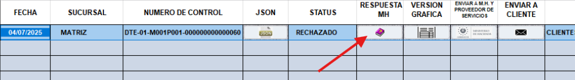
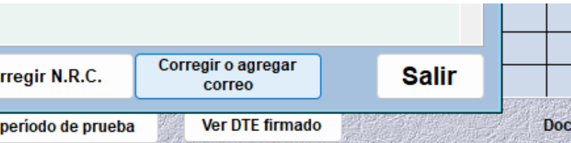
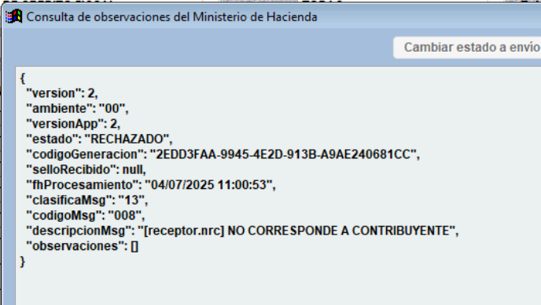
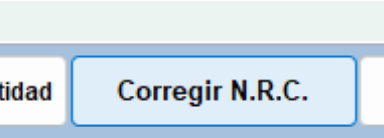
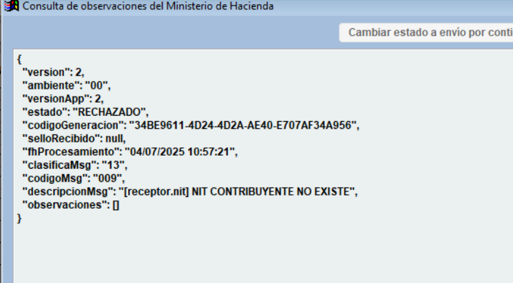
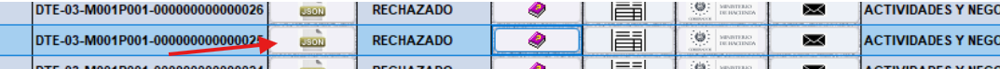
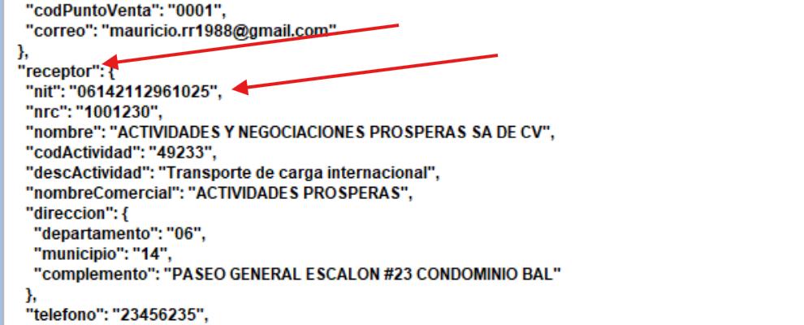
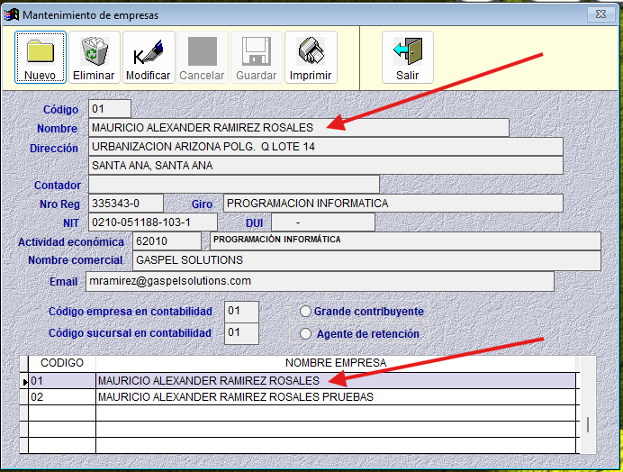
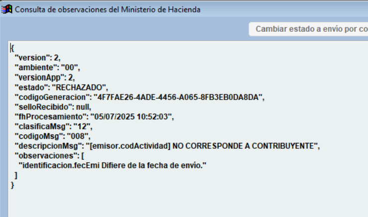

Corrección de DTE
=================

Esta guía explica cómo corregir documentos tributarios electrónicos (DTE) que han sido rechazados por Hacienda por diversos motivos.

Acceso a Documentos Rechazados
-------------------------------

1. Diríjase al menú **Utilidades > Administrar documentos tributarios electrónicos**.

.. image:: _static/rechazos_img/menu_dte.png
   :alt: Acceso a Documentos Rechazados

2. Seleccione el tipo de documento (Factura de consumidor final, comprobante de crédito fiscal, nota de crédito, etc.) que ha sido rechazado.

3. El estado del documento debe estar en **Rechazado**.

Hacienda puede rechazar documentos por diversas razones, entre ellas: errores en el correo electrónico, NRC, NIT o en el número de actividad económica. A continuación, se presentan algunos ejemplos de estos errores y las formas de corregirlos para reenviar los documentos y lograr que sean debidamente sellados por Hacienda.

DTE Rechazado por Correo Electrónico
------------------------------------

**Problema**: El correo electrónico del receptor no cumple con el formato requerido.

**Solución**:

1. Haga clic en el botón **RESPUESTA MH** 📕.

y se abrirá la siguiente ventana.

.. image:: _static/rechazos_img/respuesta-mh.png
   :alt: Ventana RESPUESTA MH

2. ⚠️ **Importante**: Preste atención al mensaje que emite Hacienda para identificar el motivo del rechazo. Cuando el mensaje indica que el documento no cumple con el esquema JSON, se debe revisar la sección de observaciones, donde se detalla el problema específico.

3. El mensaje suele señalar el campo exacto del archivo JSON donde se encuentra el error. Por ejemplo: ``#receptor/correo`` indica que el error está en el campo del correo electrónico del receptor.

4. En la parte inferior derecha de la pantalla encontrará un botón para corregir el correo electrónico. Al hacer clic sobre él, el sistema ajustará automáticamente el correo, agregando el punto que hacía falta para que sea válido.

DTE Rechazado por NRC No Correspondiente a Contribuyente
--------------------------------------------------------

**Problema**: El Número de Registro (NRC) del receptor es incorrecto.

**Solución**:

1. Al revisar la respuesta de Hacienda, se puede observar en la descripción del mensaje el siguiente detalle: ``[receptor.nrc] NO CORRESPONDE A CONTRIBUYENTE``, lo que indica que el NRC ingresado no está asociado a ningún contribuyente registrado en el sistema de Hacienda.

2. Para corregir el NRC, diríjase a la parte inferior de la pantalla, junto al botón para corregir el correo electrónico, y haga clic en el botón **"Corregir N.R.C."**. Esto le permitirá actualizar el dato con la información correcta.

3. Ingrese el NRC correcto y haga clic en **OK**.

4. El sistema mostrará un mensaje confirmando que el NRC ha sido actualizado exitosamente.

DTE Rechazado por NIT de Contribuyente No Existente
---------------------------------------------------

**Problema**: El NIT del receptor es incorrecto o no existe.

**Solución**:

1. Cuando Hacienda rechaza un documento debido a un error en el NIT, es necesario corregir directamente el archivo JSON.

2. En el mensaje de respuesta, se indicará la ubicación exacta del error dentro del archivo, por ejemplo: ``[receptor.nit]``, lo que señala que el problema se encuentra en el campo del NIT del receptor.

3. Para corregir el archivo debe hacer clic en el botón llamado **JSON**.

4. Se abrirá una ventana con el contenido del JSON y debe hacer clic en el botón **Editar**.

5. En este archivo debe buscar el campo ``receptor.nit``.

.. danger::

   Una vez que haya corregido el problema en el archivo JSON, asegúrese de que:
   
   - Las comillas al inicio y al final del valor del campo no se hayan eliminado
   - La coma que separa ese campo del siguiente se mantenga
   - De lo contrario, se romperá la estructura del archivo JSON y generará errores al intentar enviarlo nuevamente

.. note::
   **Consejo de seguridad**
   
   Si tiene temor de arruinar la estructura del JSON, puede:
   
   1. Seleccionar todo el texto del JSON con la combinación de teclas CTRL + A
   2. Presionar CTRL + C para copiar todo el contenido
   3. Abrir el Bloc de notas y pegar el texto para tener un respaldo
   4. Realizar las modificaciones necesarias en el sistema

6. Hacer clic en **Guardar**.

DTE Rechazado por Código de Actividad
-------------------------------------

**Problema**: El código de actividad indicado no corresponde al contribuyente.

.. important::
   Existen 2 casos para este rechazo:
   
   - El código de actividad económica no corresponde al contribuyente del **EMISOR**.
   - El código de actividad económica no corresponde al contribuyente del **RECEPTOR**.

   el descrito a continuación es para el caso de que el código de actividad económica no corresponde al contribuyente del **EMISOR**.

**Solución**:

1. Si el documento fue rechazado por el código de actividad económica del **EMISOR** quiere decir que los datos de la empresa no están configurados correctamente, para corregirlo debe dirigirse a **Archivos Maestros > Maestro de Empresas**.

2. Se asegura que la empresa está seleccionada en la tabla de empresas y luego hace click en el botón de **MODIFICAR**
3. Se posicióna en la caja de texto de **Actividad Económica** e ingresa el código de actividad económica correspondiente al contribuyente, si no sabe cual es el código puede buscarlo con la ayuda presionando F4.

.. image:: _static/rechazos_img/textbox-giro.png
   :alt: Caja de texto de Actividad Económica

4. Luego presiona el botón de **Guardar** para guardar los cambios.

**Para corregir el rechazo del DTE sigue los siguientes pasos:**

1. El motivo del rechazo por parte de Hacienda es que el código de actividad indicado no corresponde al contribuyente. Este código se encuentra en el campo ``[emisor.codActividad]``.

2. Para corregirlo, debemos abrir el archivo JSON del documento y ubicar el campo ``[emisor.codActividad]``.

.. image:: _static/rechazos_img/giro-incorrecto.png

3. Se debe verificar cuál es el código y la descripción de la actividad económica correspondiente al contribuyente.

4. En este ejemplo, la actividad es Programación informática, con el código 62010.

.. danger::

   Una vez que haya corregido el problema en el archivo JSON, asegúrese de que:
   
   - Las comillas al inicio y al final del valor del campo no se hayan eliminado
   - La coma que separa ese campo del siguiente se mantenga
   - De lo contrario, se romperá la estructura del archivo JSON y generará errores al intentar enviarlo nuevamente

.. note::
   **Consejo de seguridad**
   
   Si tiene temor de arruinar la estructura del JSON, puede:
   
   1. Seleccionar todo el texto del JSON con la combinación de teclas CTRL + A
   2. Presionar CTRL + C para copiar todo el contenido
   3. Abrir el Bloc de notas y pegar el texto para tener un respaldo
   4. Realizar las modificaciones necesarias en el sistema

5. Finalmente hacer clic en **Guardar**.

En caso de ser el código de actividad económica del **RECEPTOR** el que no corresponde, debe:

1. Dirigirse a **Archivos Maestros > Mantenimiento de Clientes**.
2. Presionar el botón de **CONSULTAR**.
3. Ingresar el código del cliente o lo busca con la ayuda presionando F4 y luego presionar la tecla ENTER.
4. Ya teniendo el cliente seleccionado, debe hacer click en el botón de **MODIFICAR**.
5. Se posiciona en la caja de texto de **Actividad Económica** e ingresa el código de actividad económica correspondiente al contribuyente, si no sabe cual es el código puede buscarlo con la ayuda presionando F4.
6. Luego presiona el botón de **Guardar** para guardar los cambios.

Para corregir el rechazo del DTE sigue los mismos pasos que para el caso del **EMISOR** pero en este caso se debe buscar el código de actividad económica del **RECEPTOR**.

Reenvío de Documentos Corregidos
--------------------------------

Una vez corregidos los errores en el documento:

1. Para enviarlo nuevamente y sea sellado por Hacienda, haga clic en el botón **Enviar a M.H. y proveedor de servicios**.

2. El estatus del documento cambiará a **Sellado**.

3. Puede hacer clic en el botón **Enviar a cliente** para enviarlo nuevamente al cliente. 