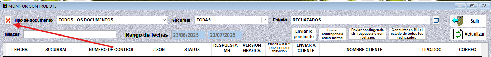

Cálculos Incorrectos
====================

**Problema**: Un monto calculado en el DTE es incorrecto, lo que provoca que el DTE sea rechazado por Hacienda.

.. code-block:: javascript

   {
      "version": 2,
      "ambiente": "01",
      "versionApp": 2,
      "estado": "RECRAZADO",
      "codigoGeneracion": "BC29995-51A8-404F-8A47-50942DKESAR",
      "selloRecibido": null,
      "fhProcesamiento": "23/07/2025 08:51:25",
      "clasificaMsg": 14,
      "codigoMsg": 100,
      "descripcionMsg": "[resumen.totalCompra Cálculo incorrecto en Total de Operaciones] VALOR NO VALIDO",
      "observaciones": []
   }

**Solución**:

La solución más eficiente es eliminar el dte rechazado y volver a emitir el documento, para esto debe seguir los siguientes pasos:

1. Ir al menú de **Utilidades** y seleccionar **Administración de Documentos tributarios electrónicos**.
2. Hacer click sobre el dte rechazado que se quiere eliminar.
3. Hacer click en la X roja que está a la izquierda del menú desplegable de **Tipo de documento**.

Aparecerá un mensaje de confirmación, hacer click en **Si**.

4. Luego, dependiente si el tipo de documento es de Venta o Compra, debe ir a consultar los movimientos de venta o compra para buscar el documento a anular:

   .. raw:: html

       

   * Si es de Venta: Menú **Facturación Ventas** y seleccionar **Consulta general de movimientos de venta**

   .. raw:: html

       

   * Si es de Compra: Menú **Facturación Compras** y seleccionar **Consulta general de movimientos de compra** (Elige el de GASTO o INVENTARIO según corresponda)

   .. raw:: html

       
5. Cuando se encuentre el movimiento, hacer click en el botón "Ver" para consultar el documento. 
6. Hacer click en el botón **"Eliminar"**, el sistema mostrará un mensaje de confirmación, al aceptarlo el sistema preguntará si desea guardar el el documento como anulador, elige **"Si"**, luego el sistema le pedirá unos datos que deberá llenar y al terminar el documento quedará completamente anulado.

Ya con el documento anulado, se puede volver a emitir el documento con los datos correctos.