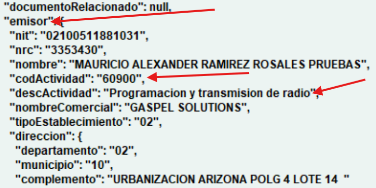

DTE Rechazado por Código de Actividad
=====================================

**Problema**: El código de actividad indicado no corresponde al contribuyente.

.. important::
   Existen 2 casos para este rechazo:
   
   - El código de actividad económica no corresponde al contribuyente del **EMISOR**.
   - El código de actividad económica no corresponde al contribuyente del **RECEPTOR**.

   El descrito a continuación es para el caso de que el código de actividad económica no corresponde al contribuyente del **EMISOR**.

**Solución**:

1. Si el documento fue rechazado por el código de actividad económica del **EMISOR** quiere decir que los datos de la empresa no están configurados correctamente, para corregirlo debe dirigirse a **Archivos Maestros > Maestro de Empresas**.

.. image:: ../_static/rechazos_img/maestro-empresas.png
   :alt: Maestro de Empresas

2. Se asegura que la empresa está seleccionada en la tabla de empresas y luego hace click en el botón de **MODIFICAR**
3. Se posicióna en la caja de texto de **Actividad Económica** e ingresa el código de actividad económica correspondiente al contribuyente, si no sabe cual es el código puede buscarlo con la ayuda presionando F4.

4. Luego presiona el botón de **Guardar** para guardar los cambios.

**Para corregir el rechazo del DTE sigue los siguientes pasos:**

1. El motivo del rechazo por parte de Hacienda es que el código de actividad indicado no corresponde al contribuyente. Este código se encuentra en el campo ``[emisor.codActividad]``.

.. image:: ../_static/rechazos_img/rechazo-actividad.png
   :alt: Rechazo por Actividad

2. Para corregirlo, debemos abrir el archivo JSON del documento y ubicar el campo ``[emisor.codActividad]``.

3. Se debe verificar cuál es el código y la descripción de la actividad económica correspondiente al contribuyente.

4. En este ejemplo, la actividad es Programación informática, con el código 62010.

.. danger::

   Una vez que haya corregido el problema en el archivo JSON, asegúrese de que:
   
   - Las comillas al inicio y al final del valor del campo no se hayan eliminado
   - La coma que separa ese campo del siguiente se mantenga
   - De lo contrario, se romperá la estructura del archivo JSON y generará errores al intentar enviarlo nuevamente

.. note::
   **Consejo de seguridad**
   
   Si tiene temor de arruinar la estructura del JSON, puede:
   
   1. Seleccionar todo el texto del JSON con la combinación de teclas CTRL + A
   2. Presionar CTRL + C para copiar todo el contenido
   3. Abrir el Bloc de notas y pegar el texto para tener un respaldo
   4. Realizar las modificaciones necesarias en el sistema

5. Finalmente hacer clic en **Guardar**.

En caso de ser el código de actividad económica del **RECEPTOR** el que no corresponde, debe:

1. Dirigirse a **Archivos Maestros > Mantenimiento de Clientes**.
2. Presionar el botón de **CONSULTAR**.
3. Ingresar el código del cliente o lo busca con la ayuda presionando F4 y luego presionar la tecla ENTER.
4. Ya teniendo el cliente seleccionado, debe hacer click en el botón de **MODIFICAR**.
5. Se posiciona en la caja de texto de **Actividad Económica** e ingresa el código de actividad económica correspondiente al contribuyente, si no sabe cual es el código puede buscarlo con la ayuda presionando F4.
6. Luego presiona el botón de **Guardar** para guardar los cambios.

Para corregir el rechazo del DTE sigue los mismos pasos que para el caso del **EMISOR** pero en este caso se debe buscar el código de actividad económica del **RECEPTOR**. 