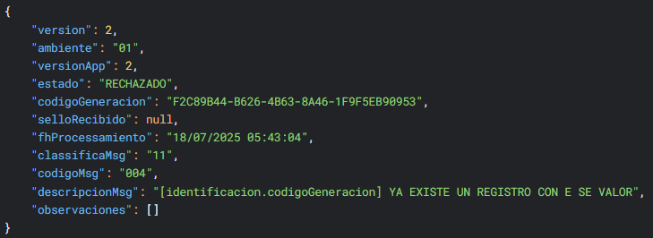
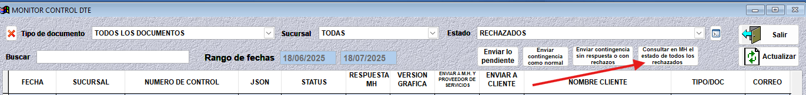

DTE Rechazado por Código de Generación Existente
================================================

**Problema**: El código de generación ya existe en hacienda.

**Solución**:

1. El el módulo de **Administrar documentos tributarios electrónicos** haga clic en el botón **Consultar en MH el estado de todos los rechazados**.

Este proceso validará con hacienda si el documento actual ya existe, de ser así, obtendrá el sello de recibido y se cambiará el estado a sellado.

.. important::

   Si el documento **NO** cambió a sellado, tiene que verificar directamente en la página de hacienda:

   https://admin.factura.gob.sv/consultaPublica

   Ingrese los datos en el formulario de consulta pública y presiona el botón **Consultar**. Si el documento no existe, favor de notificar al supervisor del sistema.

