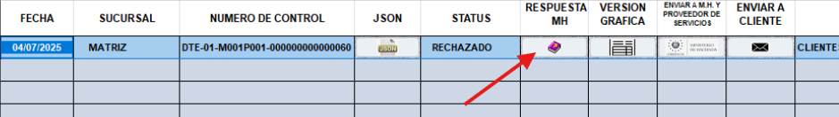
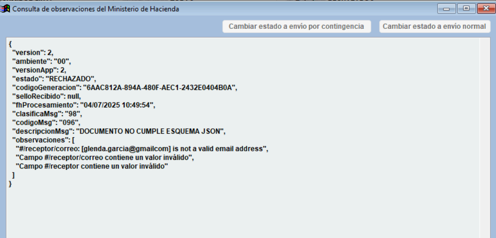
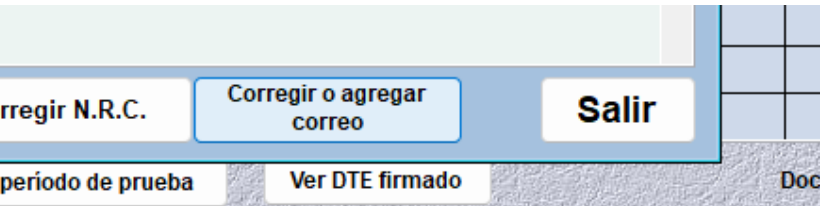

Correo Electrónico Inválido
====================================

**Problema**: El correo electrónico del receptor no cumple con el formato requerido.

**Solución**:

1. Haga clic en el botón **RESPUESTA MH** 📕.

y se abrirá la siguiente ventana.

2. ⚠️ **Importante**: Preste atención al mensaje que emite Hacienda para identificar el motivo del rechazo. Cuando el mensaje indica que el documento no cumple con el esquema JSON, se debe revisar la sección de observaciones, donde se detalla el problema específico.

3. El mensaje suele señalar el campo exacto del archivo JSON donde se encuentra el error. Por ejemplo: ``#receptor/correo`` indica que el error está en el campo del correo electrónico del receptor.

4. En la parte inferior derecha de la pantalla encontrará un botón para corregir el correo electrónico. Al hacer clic sobre él, el sistema ajustará automáticamente el correo, agregando el punto que hacía falta para que sea válido.

