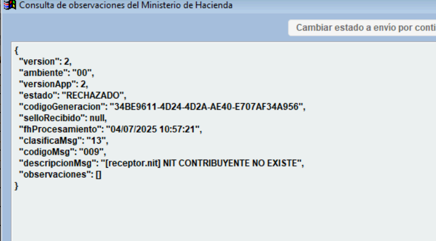
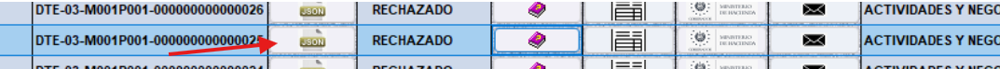
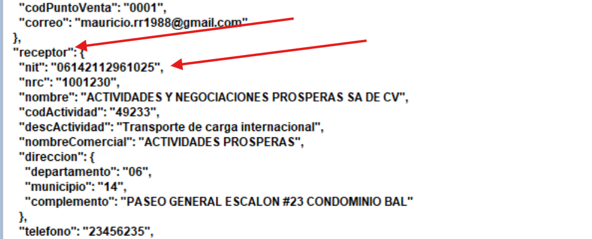

DTE Rechazado por NIT de Contribuyente No Existente
===================================================

**Problema**: El NIT del receptor es incorrecto o no existe.

**Solución**:

1. Cuando Hacienda rechaza un documento debido a un error en el NIT, es necesario corregir directamente el archivo JSON.

2. En el mensaje de respuesta, se indicará la ubicación exacta del error dentro del archivo, por ejemplo: ``[receptor.nit]``, lo que señala que el problema se encuentra en el campo del NIT del receptor.

3. Para corregir el archivo debe hacer clic en el botón llamado **JSON**.

4. Se abrirá una ventana con el contenido del JSON y debe hacer clic en el botón **Editar**.

5. En este archivo debe buscar el campo ``receptor.nit``.

.. danger::

   Una vez que haya corregido el problema en el archivo JSON, asegúrese de que:
   
   - Las comillas al inicio y al final del valor del campo no se hayan eliminado
   - La coma que separa ese campo del siguiente se mantenga
   - De lo contrario, se romperá la estructura del archivo JSON y generará errores al intentar enviarlo nuevamente

.. note::
   **Consejo de seguridad**
   
   Si tiene temor de arruinar la estructura del JSON, puede:
   
   1. Seleccionar todo el texto del JSON con la combinación de teclas CTRL + A
   2. Presionar CTRL + C para copiar todo el contenido
   3. Abrir el Bloc de notas y pegar el texto para tener un respaldo
   4. Realizar las modificaciones necesarias en el sistema

6. Hacer clic en **Guardar**. 