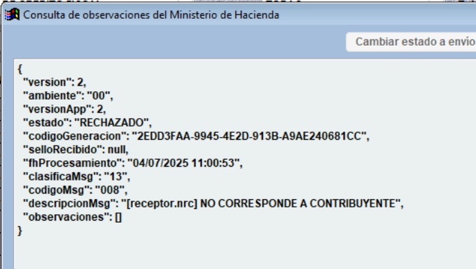
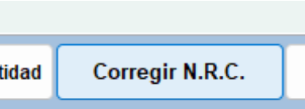

NRC No Correspondiente a Contribuyente
========================================================

**Problema**: El Número de Registro (NRC) del receptor es incorrecto.

**Solución**:

1. Al revisar la respuesta de Hacienda, se puede observar en la descripción del mensaje el siguiente detalle: ``[receptor.nrc] NO CORRESPONDE A CONTRIBUYENTE``, lo que indica que el NRC ingresado no está asociado a ningún contribuyente registrado en el sistema de Hacienda.

2. Para corregir el NRC, diríjase a la parte inferior de la pantalla, junto al botón para corregir el correo electrónico, y haga clic en el botón **"Corregir N.R.C."**. Esto le permitirá actualizar el dato con la información correcta.

3. Ingrese el NRC correcto y haga clic en **OK**.

4. El sistema mostrará un mensaje confirmando que el NRC ha sido actualizado exitosamente. 