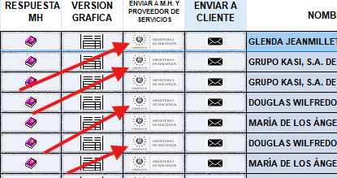

Reenvío de Documentos Corregidos
================================

Una vez corregidos los errores en el documento:

1. Para enviarlo nuevamente y sea sellado por Hacienda, haga clic en el botón **Enviar a M.H. y proveedor de servicios**.

2. El estatus del documento cambiará a **Sellado**.

3. Puede hacer clic en el botón **Enviar a cliente** para enviarlo nuevamente al cliente. 