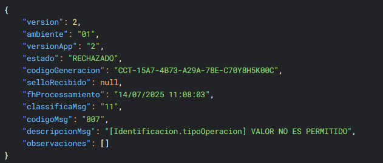
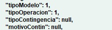

Valor Tipo Operación No Permitido
===================================================

**Problema**: El valor del tipo de operación no es permitido.

**Solución**:

1. El el módulo de **Administrar documentos tributarios electrónicos** haga clic en el botón **JSON** del documento rechazado.

2. Hace click en el botón **EDITAR**.

3. En el bloque de **Identificación** estaran los siguientes campos:

- tipoModelo
- tipoOperacion
- tipoContingencia
- motivoContin

los valores serán incorrectos y por lo tanto se deben corregir a lo siguiente:

4. Haga click en el botón **GUARDAR** y ya podrá reenviar el documento a hacienda y, si no hay más errores, el documento será sellado.